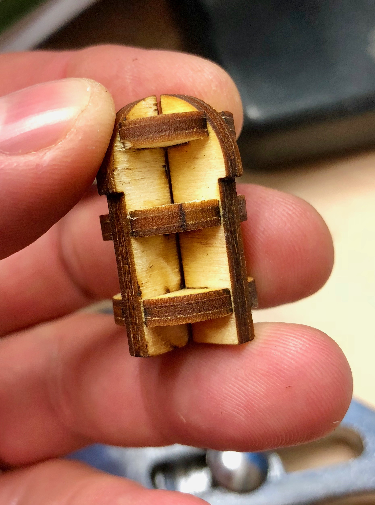
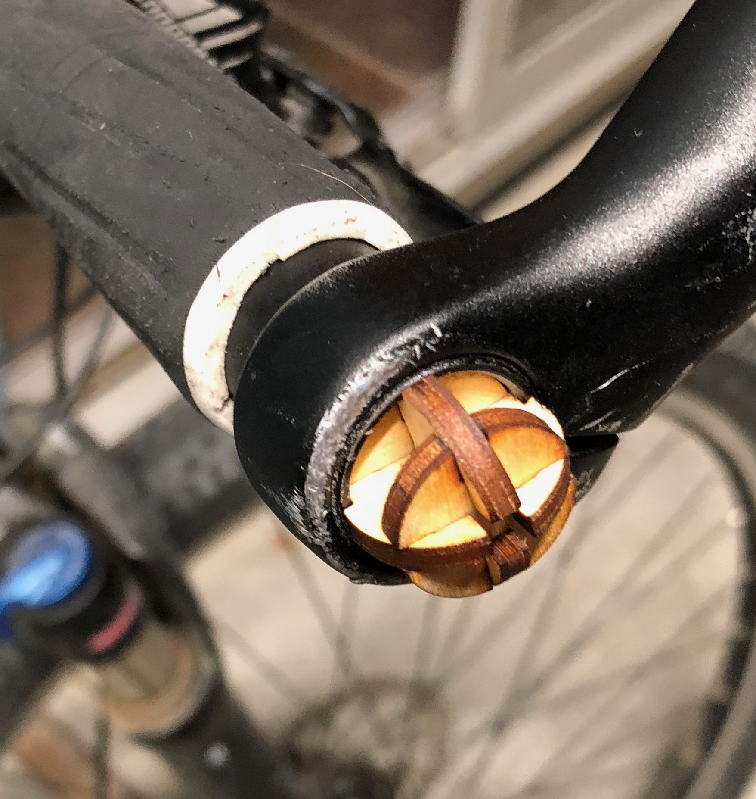

## Bike Handle Plug

The plastic end plugs on my mountain bike's handlebars have long gone missing.   Needed a replacement.

Cut some out of 3mm baltic birch plywood.  Tight fit for these handlebars.

Design is easy to replicate.

1. Measure inside diameter of handlebar.
2. Create a cross section of a plug shape where the end is slightly narrower than the measured ID.
3. At the other end, create a flange.  Interior diameter of the flange should be just slightly (a few thousands of an inch) larger than the measured ID.
4. Create an arc on top of the flange bit.   The whole thing should look a bit like the cross section of a bolt.

	**Note:** At this point, you should have a *closed vector graphic* in the shape of a cross section of the plug.   If you wanted, you could cut this cross section out and make sure it fits!

5. Cut the design in half long wise.
6. Select the shape and revolve to create a 3D plug (which you'll see in the Fusion 360 document, the sketch is hidden and can be revealed, too).

	**Note:** You could 3D print the plug at this point, then slice and print!  If you want to laser cut it, proceed.

7. Export to Fusion 360 Slicer.
8. Configure your material.
9. Make sure "Original Size" is checked so Slicer doesn't scale.
10. Select a Radial slice and adjust to ~4 slices in the radial direction and 3 or 4 in the lengthwise direction.

	**Note:** What follows is specific to OS X, but will probably work on Windows or Linux, with the appropriate software installed.

11. Export to computer as PDF.
12. Open in Inkscape.
13. Select bounding box and ungroup twice.
14. Delete the bounding box.   Re-arrange things if you want.
15. Upload to the Glowforge (or other laser cutter) and cut as you normally would.

	**Note:** The red asembly instructions are unusable at this scale of work.  That's OK because it is likely that the parts are pretty identical (the discs may *not* be, depending on how you sliced it).

16. Assemble and install.  If you enter an accurate material thickness and a very small cutting tool width (for a laser cutter), it is likely that the piece will snap togehter very tightly!

